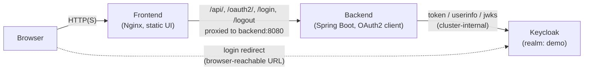

# poc-k8s-auth-demo


A small, self-contained proof-of-concept that shows **Kubernetes-native authentication with Keycloak (OIDC)** in front of a Spring Boot API, fronted by a static Nginx UI. It is a learning/demo project, not a production authentication reference — see [Security Considerations](#security-considerations) before reusing any part of it.

## Executive summary

- **Frontend**: static HTML/JS served by Nginx, proxies `/api/`, `/oauth2/`, `/login`, `/logout` to the backend.
- **Backend**: Spring Boot 3.5.3 (Java 17) app using Spring Security's OAuth2/OIDC client to authenticate against Keycloak, exposing a couple of protected REST endpoints.
- **Keycloak**: a single realm (`demo`), one confidential client (`sample-app`), one demo user — preloaded via realm import so the whole stack comes up ready to log in.
- **Three deployment paths**, all driving the same three containers: raw Kubernetes manifests (`k8s/`), a Helm chart (`helm/poc-k8s-auth-demo/`), and Docker Compose (`docker-compose.yml`) for a non-Kubernetes sanity check.

## Architecture



Key design point carried through every deployment method: the backend talks to Keycloak using the **internal cluster service name** (`http://keycloak:8080`) for token exchange, userinfo, and JWKS calls, while the **authorization endpoint** the browser is redirected to must be a **browser-reachable URL** (e.g. `http://localhost:30081`). Mixing these up is the most common failure mode in this kind of setup, and it's called out repeatedly in the deeper docs below.

## Repository layout

```text
k8s-auth-demo/
├── README.md              # quickstart: build images, run on Docker Desktop / Minikube / Kind
├── DEPLOYMENT.md          # architecture, Dockerfiles, manifests, hostname/URL rules, troubleshooting
├── HELM.md                # Helm chart usage, CI snippet, debugging tips
├── code-explanation/      # architecture.md, backend.md, frontend.md — line-level walkthroughs
├── backend/                # Spring Boot app (Java 17, Maven)
├── frontend/                # static UI + Nginx reverse proxy config
├── keycloak/                # custom Keycloak image + realm-export.json
├── helm/poc-k8s-auth-demo/  # Helm chart for all three components
├── k8s/                     # plain Kubernetes manifests (Deployment + Service per component)
├── docker-compose.yml       # local, non-Kubernetes run
└── build-images.sh          # builds all three images with pinned tags
```

## Where to go next

This README is intentionally an overview. For hands-on instructions, use:

| Need | Document |
|---|---|
| Build images and run on Docker Desktop / Minikube / Kind | [`k8s-auth-demo/README.md`](k8s-auth-demo/README.md) |
| Full architecture, Dockerfile internals, manifest details, hostname/URL rules, troubleshooting | [`k8s-auth-demo/DEPLOYMENT.md`](k8s-auth-demo/DEPLOYMENT.md) |
| Installing/upgrading via the Helm chart, CI linting snippet | [`k8s-auth-demo/HELM.md`](k8s-auth-demo/HELM.md) |
| Line-by-line explanation of the architecture, backend, frontend code | [`k8s-auth-demo/code-explanation/`](k8s-auth-demo/code-explanation/) |

## Security considerations

This is a **demo/POC**, not a hardened reference implementation. Findings from reviewing `keycloak/realm-export.json`, the Kubernetes manifests, and the Helm `values.yaml`:

- **Credentials are hardcoded and committed to source control.** The Keycloak client secret (`sample-secret`), the demo user's password (`demo123`), and the Keycloak admin credentials (`admin` / `admin`) all appear in plaintext across `keycloak/realm-export.json`, `k8s/backend.yaml`, `k8s/keycloak.yaml`, `helm/poc-k8s-auth-demo/values.yaml`, and `docker-compose.yml`.
- **These read as obvious placeholder/demo values**, not real-looking production secrets (short, guessable, self-descriptive names like `admin`/`admin` and `sample-secret`). There is no indication of an accidentally-committed real credential.
- **They are still a bad pattern to copy.** Nothing here uses Kubernetes `Secret` objects, Helm `--set-file`/external secret stores, or `.gitignore`-excluded value overrides — every credential is baked into version-controlled YAML/JSON. The Helm chart's own README already flags this ("Do not store secrets directly in `values.yaml`") but the chart doesn't yet enforce it.
- **Keycloak runs in `start-dev` mode** (`kc.sh start-dev --import-realm`) with `KC_HOSTNAME_STRICT: "false"` — appropriate for local demo/testing, unsuitable for any non-ephemeral or externally reachable deployment.
- **No TLS anywhere** — all traffic (browser, frontend-to-backend, backend-to-Keycloak) is plain HTTP, consistent with a local-cluster demo.
- **CSRF protection is disabled** on the backend (`http.csrf(AbstractHttpConfigurer::disable)` in `SecurityConfig.java`) — acceptable for a stateless-ish demo API exercised by same-origin requests via the Nginx proxy, but worth knowing if this code is adapted elsewhere.

**Recommendation if any of this is reused beyond a demo:** move all three secrets into Kubernetes `Secret`/Helm `Secret` templates (referenced via `envFrom`/`valueFrom`), switch Keycloak off `start-dev`, and terminate TLS at the ingress.

## Known issues / recommendations

- **No CI pipeline.** There is no GitHub Actions workflow in this repo — `HELM.md` includes a suggested `helm lint`/`helm template` snippet, but it isn't wired up. Adding a basic workflow (Maven build, `helm lint`, `docker build`) would materially raise the bar for a portfolio piece.
- **No automated tests.** The backend has no test sources (`src/test` is absent), and there's no `helm test` job despite the Helm chart README suggesting one as a "recommended" next step.
- **Build artifacts are committed to git.** `k8s-auth-demo/backend/target/` (compiled `.class` files and Maven metadata) is tracked in version control. A `.gitignore` has now been added at the repo root to prevent new build output from being committed, but the existing tracked files under `target/` were left in place since removing already-tracked history-bearing files was outside the scope of this documentation pass — a maintainer should run `git rm -r --cached k8s-auth-demo/backend/target` in a follow-up commit.
- **Secret handling**, as detailed above — fine for a local demo, would need rework before any shared or persistent environment.
- **Leftover conversational/AI-assistant phrasing** in a couple of places (e.g. `helm/poc-k8s-auth-demo/README.md` and `Chart.yaml`'s `description` field, such as "Fantastic Quickstart" and "tell me which one and I'll implement it") reads as unpolished for a portfolio-facing repo and is worth a copy pass — `HELM.md` at the `k8s-auth-demo/` root has already been cleaned up as part of this review.
- **Environment-specific URLs are hardcoded** (`localhost:30081`, `192.168.58.2:30080`) in the realm export, manifests, and Helm defaults. This is documented clearly in `DEPLOYMENT.md`, but it means any new host/port requires manual edits in three separate places (Keycloak redirect URIs, backend env vars, `KC_HOSTNAME`) — a good candidate for future consolidation via Helm templating.

## License

[MIT](LICENSE)
